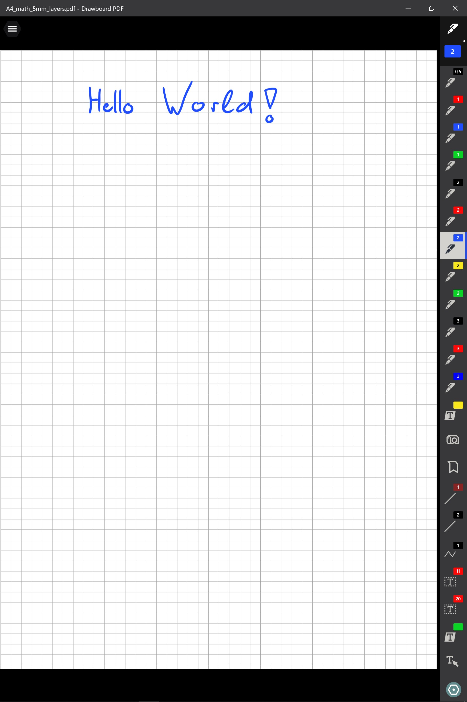
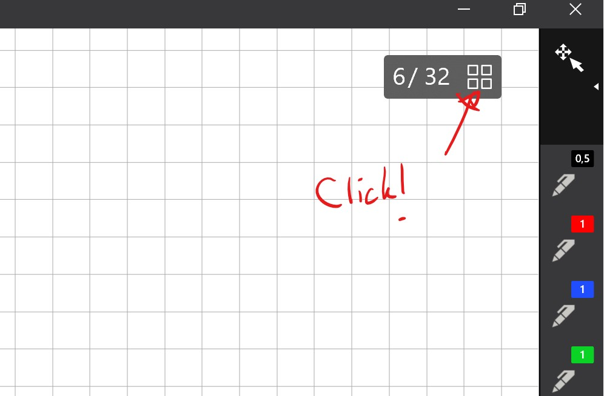
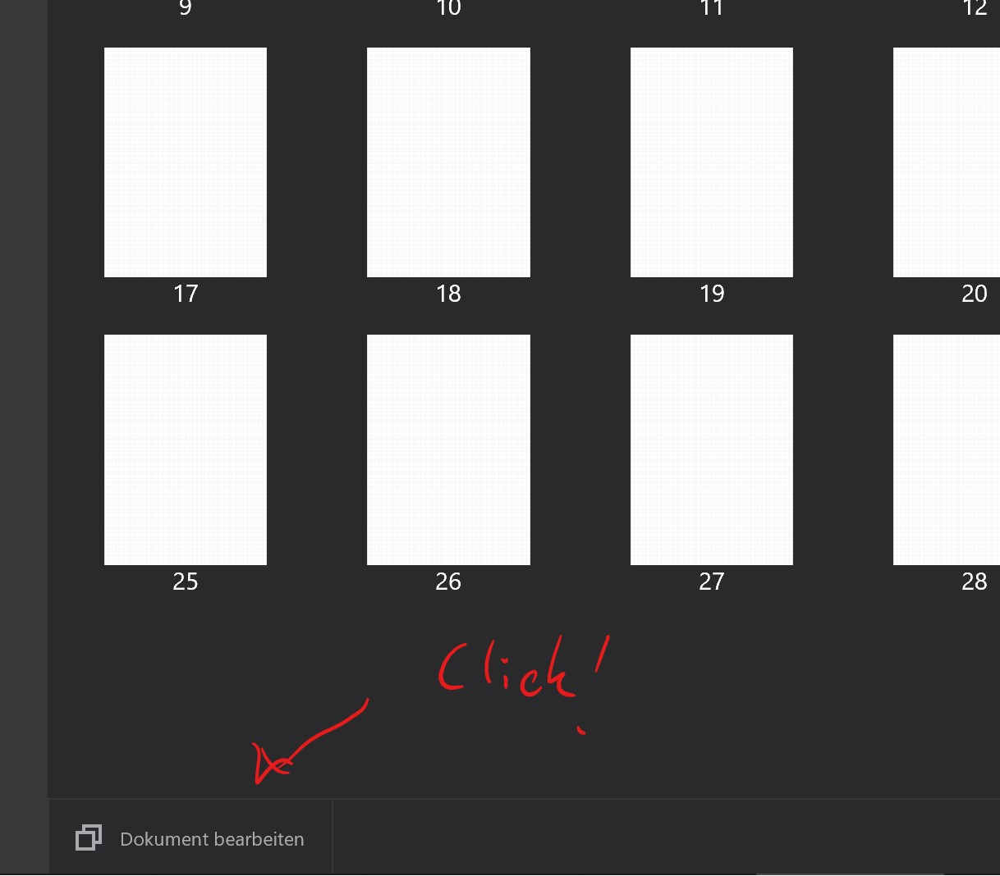
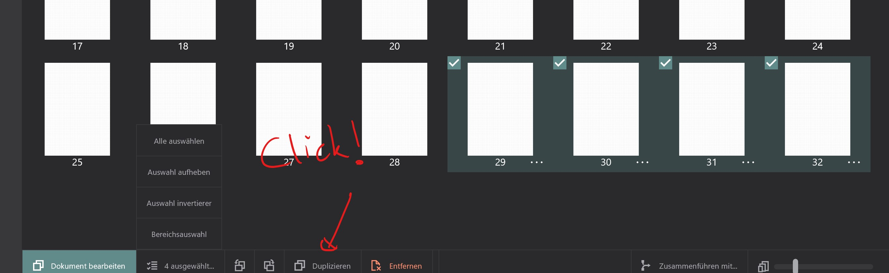
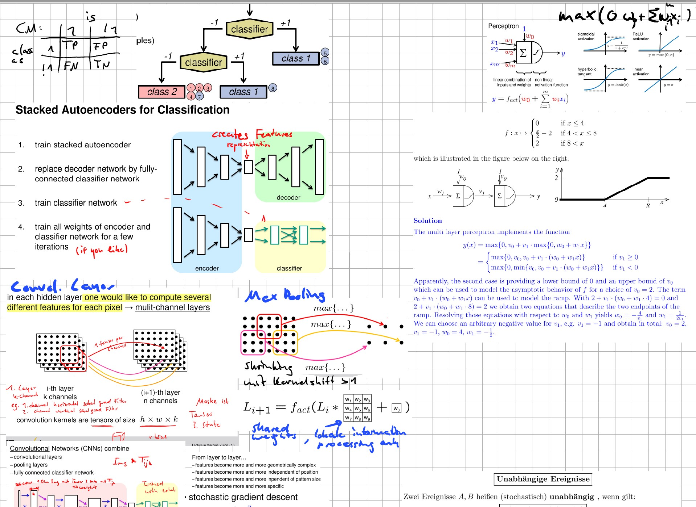
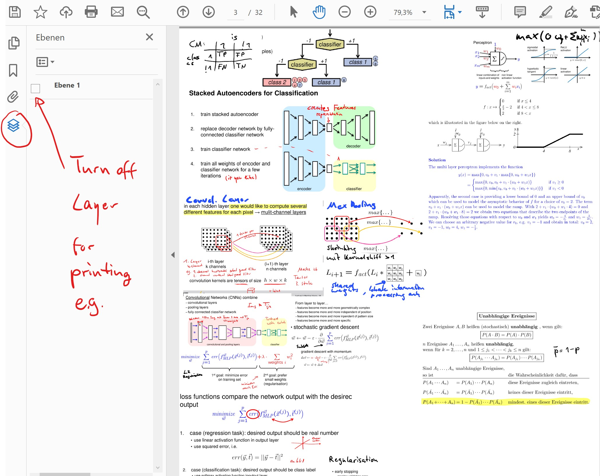

# PDF_Gridlines_Templates
Here you can get Templates for Drawboard PDF with 5mm Gridlines that can be turned of in PDF Reader that support Layers.

## In Drawboard PDF

## Add new Pages

Duplicate the pages for new page insertion

## Grid ON/OFF for printing or viewing

**With Layers turned off:**

